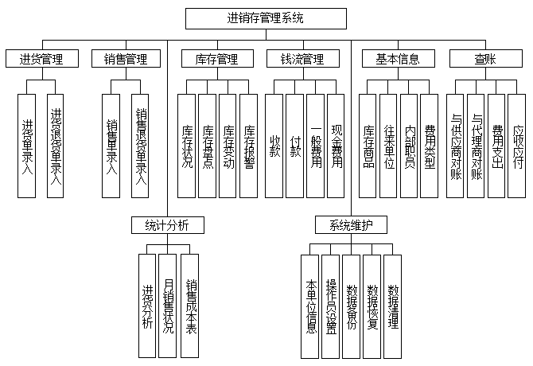
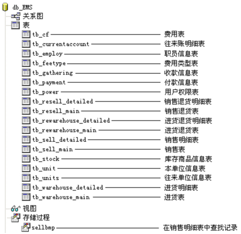

###############################################################################
进销存管理系统
###############################################################################

..
    # with overline, for parts
    * with overline, for chapters
    =, for sections
    -, for subsections
    ^, for subsubsections
    ", for paragraphs

.. contents::
.. .. sectnum::

*******************************************************************************
1. 概述
*******************************************************************************

随着我国经济的高速发展， 中小企业在社会经济中扮演的角色越来越重要， 已成为最多元化和最\
具创新精神的部分。 但是随着企业的发展， 客户的增多， 企业账目混乱， 库存不准， 信息反\
馈不及时等问题也接踵而至。 这些问题已成为制约中小企业发展的瓶颈， 严重制约了中小企业的\
发展壮大。 越来越多的企业经营者认识到： 单纯靠对商品的占有， 靠个人经验， 已经很难把握\
市场， 很难在激烈的竞争中取胜。 如何借助 IT 手段、 如何通过信息化， 加强核心竞争力， \
实现持续发展已成为中小企业亟待解决的关键问题。

我国中小企业有 70% 是零售企业， 企业经营涉及进、 销、 存多个环节， 涉及商品种类繁多\
， 业务量大， 库存管理复杂， 使用手工管理已无法胜任。 如何采用先进的计算机系统管理进\
货、 库存、 销售等诸多环节也已成为趋势及必然。

*******************************************************************************
2. 系统分析
*******************************************************************************

2.1 需求分析
===============================================================================

通过调查， 要求系统需要有以下功能： 

- 要有良好的人机界面， 并提供换肤功能。
- 支持多人操作， 要求有较好的权限分配功能。
- 在进货、 退货时存在一对多的关系， 要求支持多行录入功能。
- 为了方便用户查询， 要求支持多条件查询。
- 对于每种商品要求编号惟一， 编号需要自动生成。
- 支持多种报表打印。
- 支持账目的详细内容浏览。

2.2 可行性分析
===============================================================================

开发任何一个基于计算机的系统， 都会受到时间和资源上的限制。 因此， 在接受任何一个项目\
开发任务之前， 必须根据客户可能提供的时间和资源条件进行可行性分析， 以减少项目开发风\
险， 避免人力、 物力和财力的浪费。

本系统数据库采用目前比较流行的 Microsoft SQL Server， 该数据库系统在安全性、 准确性\
、 运行速度方面有绝对的优势， 并且处理数据库量大， 效率高； 开发工具采用 Delphi7， \
Delphi7 是目前应用最广泛的数据库系统开发工具， 可以快速开发 Windows 应用程序。

*******************************************************************************
3. 总体设计
*******************************************************************************

3.1 项目规划
===============================================================================

进销存管理系统是一个典型的数据库应用程序， 由登录模块、 主界面、 基本信息模块、 进货管\
理和销售管理模块、 钱流管理模块、 库存管理模块、 查帐模块、 统计与分析模块、 系统维护\
模块等组成。 特规划功能模块如下：

- 基本信息模块

  基本信息模块的主要实现库存商品、内部职员、往来单位、费用类型信息等管理。

- 进货管理模块

  进货管理模块主要管理企业商品进货及退货信息，支持多行录入。

- 销售管理模块

  销售管理模块主要管理企业商品销售及退货信息，支持多行录入。

- 钱流管理模块

  钱流管理模块主要实现往来账目的录入和账目的详细信息浏览等功能。

- 库存管理模块

  库存管理模块主要实现库存货品浏览、库存盘点、库存报警等功能。

- 统计分析模块

  查账模块主要实现进货统计分析、销售统计分析和成本分析等功能。

- 查账模块

  查账模块主要实现与供应商、代理商对帐、费用管理、应收应付等功能。

- 系统维护模块

  系统维护模块的主要实现本单位管理、操作员设置、数据的备份和还原等功能。

3.2 功能框图
===============================================================================

   图 3.2-1 功能框图

*******************************************************************************
4. 系统设计
*******************************************************************************

4.1 设计目标
===============================================================================

根据企业的需求和进销存管理的特点， 该系统实施后， 应达到以下目标：

- 支持多行输入， 自动生成编号。
- 界面美观友好、 信息查询灵活、 方便、 快捷、 准确。
- 强大的库存预警功能， 在意外中将损失降到最低。
- 提高工作效率， 降低成本。
- 往来账目详细浏览。
- 图形化数据分析。
- 对用户输入的数据进行过滤， 当输入有误时提示用户。
- 数据保密性强， 用户对应不同的操作级别。
- 系统最大限度地实现了易安装性、 易维护性和易操作性。
- 直接调用 Word、 Excel 软件。
- 系统运行稳定、 安全可靠。

4.2 编码设计
===============================================================================

编码是一种商品或单据的惟一标识， 编码设计的目的是为了便于数据的存储和检索， 提高处理的\
效率和精度， 进销存管理系统中编码设计如下：

- 单据编号

  1. 进货单据编号为系统日期、 “进货” 拼音简码和 7 位数字编码的组合。 例如 \
     20050228JH0000012。
  2. 进货退货编号为系统日期、 “进货退货” 拼音简码和 7 位数字编码的组合。 例如， \
     20050228JHTH0000012。
  3. 销售单据编号为系统日期、 “销售” 拼音简码和 7 位数字编码的组合。 例如， \
     20050228XS0000012。
  4. 销售退货编号为系统日期、 “销售退货” 拼音简码和 7 位数字编码的组合， 例如， \
     20050228XSTH0000012。

- 商品编号

  商品编号为字母 “T” 和 5 位数字编码。

- 往来单位编号

  单位编号为字母 “U” 和 4 位数字编码。

- 职员编号

  职员编号为字母 “E” 和 5 位数字编码。

4.3 逻辑结构设计
===============================================================================

本系统数据库采用 SQL Server 2000 数据库， 数据库名称为 “db_EMS”。 数据库 db_EMS 中\
包含 18 个表。 下面分别给出数据库概要说明和数据表的结构。

数据库概要说明如图 1 所示。

   图 4.3-1 数据库树型结构图

1. 数据库关系概要图

   当在主键表中的数据发生改变时， 那么引用这个主键值的字段都要随之改变， 确保数据的一\
   致性和完整性， 因此在 "db_EMS" 数据库中建立关系如图 2 所示。

   .. figure:: images/db-ref.png
      :scale: 100 %
      :alt: alternate text
      :align: center

      图 4.3-2 数据库关系图

2. 主要数据表的结构
  
   #. 职员信息表 (tb_employ)

      职员信息表用来保存职员信息。 职员信息表的结构如表 1 所示。
      
      .. csv-table:: 表1 职员信息表结构
         :header: "字段名称", "字段类型", "字段大小", "主键否", "功能描述"
         :widths: auto

         "employecode", "Varchar", "6","", "职员编号"
         "fullname", "Varchar","20","是","职员全称"
         "name",Varchar,20,,职员简称
         sex,Varchar,2,,性别
         department,Varchar,20,,所在部门
         tel,Varchar,20,,联系电话
         memo,Varchar,40,,备注
         shortcode,Varchar,10,,拼音简码

   #. 进货主表 (tb_warehouse_main)
      
      进货主表用来保存进货中主要和相同的信息。 进货主表的结构如表 2 所示。

      .. csv-table:: 表2 进货主表结构
         :header: "字段名称", "字段类型", "字段大小", "主键否", "功能描述"
         :widths: auto

         Billdate,datetime,8,,录单日期
         Billcode,varchar,20,是,单据编号
         Units,varchar,20,,供货单位
         Handle,varchar,20,,经手人
         Summary,varchar,100,,摘要
         Fullpayment,float,8,,应付金额
         Payment,float,8,,实付金额

   #. 进货明细表 (tb_warehouse_detailed)
      
      进货明细表用来保存进货中商品的详细信息。 进货明细表结构如表 3 所示。

      .. csv-table:: 表3 进货明细表
         :header: "字段名称", "字段类型", "字段大小", "主键否", "功能描述"
         :widths: auto

         billcode,Varchar,20,,单据编号
         tradecode,Varchar,20,,商品编号
         fullname,Varchar,20,,商品全称
         type,Varchar,10,,商品型号
         standard,Varchar,10,,商品规格
         unit,Char,4,,单位
         produce,Varchar,20,,产地
         qty,Float,8,,数量
         price,Float,8,,进价
         tsum,Float,8,,金额
         billdate,Datetime,8,,录单日期

   #. 用户权限表 (tb_power)
      
      用户权限表用来保存用户权限设置信息。 用户权限表结构如表 4 所示。

      .. csv-table:: 表4 用户权限表结构
         :header: "字段名称", "字段类型", "字段大小", "主键否", "功能描述"
         :widths: auto

         number,Varchar,20,是,用户编号
         users,Varchar,20,,用户名称
         password,Varchar,20,,用户密码
         stock,Bit,1,,进货管理
         vendition,Bit,1,,销售管理
         checked,Bit,1,,库存管理
         money,Bit,1,,钱流管理
         system,Bit,1,,系统维护
         base,Bit,1,,基本信息

      |notice| 注意: 在设计数据表时， 数据表的命名要能代表表的意义。

      .. |notice| image:: images/notice.png

   #. 费用表 (tb_cf)
      
      费用表用来保存费用信息。 费用表结构如图 5 所示。

      .. csv-table:: 表5 费用表
         :header: "字段名称", "字段类型", "字段大小", "主键否", "功能描述"
         :widths: auto

         billdate,datetime,8,,录单日期
         billcode,Varchar,20,,单据编号
         units,Varchar,20,,收款单位
         number,Varchar,20,,费用项目编号
         name,Varchar,20,,费用项目名称
         handle,Varchar,20,,经手人
         fullpayment,float,8,,应付金额
         payment,float,8,,实付金额
         summary,varchar,20,,摘要

   #. 往来账明细表 (tb_currentaccount)
      
      往来账明细表用来保存往来帐信息。 往来账明细表结构如图 6 所示。

      .. csv-table:: 表6 往来账明细表
         :header: "字段名称", "字段类型", "字段大小", "主键否", "功能描述"
         :widths: auto

         billdate,datetime,8,,录单日期
         billcode,Varchar,20,是,单据编号
         units,Varchar,20,,往来单位
         addgathering,float,8,,应收增加
         reducegathering,float,8,,应收减少
         balance,float,8,,应收余额
         summary,varchar,100,,摘要

   #. 费用类型表 (tb_feetype)

      费用类型表用来保存费用类型信息。 费用类型细表结构如图 7 所示。

      .. csv-table:: 表7 费用类型表
         :header: "字段名称", "字段类型", "字段大小", "主键否", "功能描述"
         :widths: auto

         subjectcode,varchar,3,,科目编号
         fullname,varchar,20,是,科目全称
         name,varchar,10,,科目简称
         memo,varchar,40,,备注
         shortcode,varchar,10,,拼音简码

   #. 收款信息表 (tb_gathering)

      收款信息表用来保存收款信息。 收款信息表结构如图 8 所示。

      .. csv-table:: 表8 收款信息表
         :header: "字段名称", "字段类型", "字段大小", "主键否", "功能描述"
         :widths: auto

         billdate,datetime,8,,录单日期
         billcode,varchar,20,是,单据编号
         units,varchar,20,,付款单位
         gathering,float,8,,金额
         handle,varchar,20,,经手人
         summary,varchar,40,,摘要

   #. 付款信息表 (tb_payment)

      付款信息表用来保存付款信息。 付款信息表结构如图 9 所示。

      .. csv-table:: 表9 付款信息表
         :header: "字段名称", "字段类型", "字段大小", "主键否", "功能描述"
         :widths: auto

         billate,datetime,8,,录单日期
         billcode,varchar,20,是,单据编号
         units,varchar,20,,收款单位
         payment,float,8,,金额
         handle,varchar,20,,经手人
         summary,varchar,100,,摘要

   #. 销售退货明细表 (tb_resell_detailed)

      销售退货明细表用来保存销售退货信息。 销售退货明细表结构如图 10 所示。

      .. csv-table:: 表10 销售退货明细表
         :header: "字段名称", "字段类型", "字段大小", "主键否", "功能描述"
         :widths: auto

         billcode,varchar,20,,单据编号
         tradecode,varchar,20,,商品编号
         fullname,varchar,20,,商品全名
         standard,varchar,10,,商品规格
         type,varchar,10,,商品型号
         unit,char,4,,单位
         produce,varchar,20,,产地
         qty,float,8,,数量
         price,float,8,,单价
         tsum,float,8,,金额
         billdate,datetime,8,,录单日期

   #. 销售退货表 (tb_resell_main)

      销售退货表用来保存销售退货相关信息。 销售退货表结构如图 11 所示。

      .. csv-table:: 表11 销售退货表
         :header: "字段名称", "字段类型", "字段大小", "主键否", "功能描述"
         :widths: auto

         billdate,datetime,8,,录单日期
         bilcode,varchar,20,,单据编号
         units,varchar,20,,退货单位
         handle,varchar,20,,经手人
         summary,varchar,100,,摘要
         fllpayment,float,8,,应付金额
         payment,float,8,,实付金额

   #. 进货退货明细表 (tb_rewarehouse_detailed)

      进货退货明细表用来保存进货退货明细。 进货退货明细表结构如图 12 所示。

      .. csv-table:: 表12 进货退货明细表
         :header: "字段名称", "字段类型", "字段大小", "主键否", "功能描述"
         :widths: auto

         billcode,varchar,20,,单据编号
         tradecode,varchar,20,,商品编号
         fullname,varchar,20,,商品全称
         type,varchar,10,,商品型号
         standard,varchar,10,,商品规格
         unit,char,4,,单位
         produce,varchar,20,,产地
         qty,float,8,,数量
         price,float,8,,进价
         tsum,float,8,,金额
         billdate,datetime,8,,录单日期

   #. 进货退货表 (tb_rewarehouse_main)

      进货退货表用来保存进货退货信息。 进货退货表结构如图 13 所示。

      .. csv-table:: 表13 进货退货表
         :header: "字段名称", "字段类型", "字段大小", "主键否", "功能描述"
         :widths: auto

         billdate,datetime,8,,录单日期
         billcode,varchar,20,,单据编号
         units:,varchar,20,,收货单位
         handle,varchar,20,,经手人
         summary,varchar,100,,摘要
         fllgathering,float,8,,应付金额
         gathering,float,8,,实收金额

   #. 销售明细表 (tb_sell_detailed)

      销售明细表用来保存销售明细。 销售明细表结构如图 14 所示。

      .. csv-table:: 表14 销售明细表
         :header: "字段名称", "字段类型", "字段大小", "主键否", "功能描述"
         :widths: auto

         billcode,varchar,20,,单据编号
         tradecode,varchar,20,,商品编号
         fullame,varchar,20,,商品全称
         type,varchar,10,,商品型号
         standard,varchar,10,,商品规格
         unit,char,4,,单位
         produce,varchar,20,,产地
         qty,float,8,,数量
         price,float,8,,单价
         tsum,float,8,,金额
         billdate,datetime,8,,录单日期

   #. 销售表 (tb_sell_main)

      销售表用来保存销售信息。 销售表结构如图 15 所示。

      .. csv-table:: 表15 销售表
         :header: "字段名称", "字段类型", "字段大小", "主键否", "功能描述"
         :widths: auto

         billdate,varchar,20,,录单日期
         billcode,varchar,20,是,单据编号
         units,varchar,20,,购货单位
         handle,varchar,20,,经手人
         summary,varchar,100,,摘要
         fllathering,float,8,,应付金额
         gathering,float,8,,实收金额

   #. 库存商品信息表 (tb_stock)

      库存商品信息表用来保存库存商品信息。 库存商品信息表结构如图 16 所示。

      .. csv-table:: 表16 库存商品信息表
         :header: "字段名称", "字段类型", "字段大小", "主键否", "功能描述"
         :widths: auto

         tradecode,Varchar,6,,商品编号
         fullnamed,Varchar,20,是,商品全名
         ame,Varchar,10,,商品简称
         type,Varchar,10,,商品类型
         standard,Varchar,10,,商品规格
         unit,Varchar,4,,单位
         produce,Varchar,20,,产地
         qty,Float,8,,库存数量
         price,Float,8,,进货时的最后一次进 价
         averageprice,Float,8,,加权平均价
         saleprice,Float,8,,销售时的最后一次销 价
         checked,Float,8,,盘点数量
         upperimit,int,4,,存货报警上限
         lowertimit,int,4,,存货报警下限
         provideinf,Varchar,40,,商品供货信息
         memo,Varchar,40,,备注
         shortcode,Varchar,10,,拼音简码

   #. 本单位信息表 (tb_unit)

      本单位信息表表用来保存本单位信息。 本单位信息表结构如图 17 所示。

      .. csv-table:: 表17 本单位信息表
         :header: "字段名称", "字段类型", "字段大小", "主键否", "功能描述"
         :widths: auto

         tnumber,Varchar,20,是,单位编号
         rname,Varchar,50,,单位全称
         simplename,Varchar,10,,单位 简称
         tax,Varchar,30,,税号
         tel,Varchar,20,,单位电话
         linkman,Varchar,10,,联系人
         address,Varchar,60,,单位地址
         accounts,Varchar,80,,开户行及帐号

   #. 往来单位信息表 (tb_units)

      往来单位信息表用来保存往来单位信息。 往来单位信息表结构如图 18 所示。

      .. csv-table:: 表18 往来单位信息表
         :header: "字段名称", "字段类型", "字段大小", "主键否", "功能描述"
         :widths: auto

         unitcode,Varchar,5,,单位编号
         fullname,Varchar,20,是,单位全名
         name,Varchar,10,,单位 简称
         tax,Varchar,30,,税号
         tel,Varchar,20,,单位电话
         linlkman,Varchar,10,,联系人
         address,Varchar,60,,单位地址
         accounts,varchar,80,,开户行及帐号
         gathering,float,8,,累计应收款
         payment,float,8,,累计应付款
         shortcode,varchar,10,,拼音简码

*******************************************************************************
5. 技术准备
*******************************************************************************

5.1 命名规则
===============================================================================

1. 单元窗体命名规则

   所有的窗体以 "F\_" 开头， 如： 数据备份窗体命名为 "F_back"， 对应的单元命名为 \
   "Fback"。

2. 代码规范

   代码中如果为包含关系缩进两个字符。 begin 和 end 单独一行。

3. 数据库命名规则

   - 数据库命名以 "db\_" 开头。
   - 数据表以 "tb\_" 开头。

   在设计数据表时写上字段的描述， 便于理解字段的作用。 商品信息表结构如图 5.1-1 所示。

   .. figure:: images/5.1-1.png
      :align: center

      图5.1-1  商品信息结构

5.2 技术储备
===============================================================================

TADOQuery 组件的常用方法， 如表 5.2-1 所示。

.. table:: 表5.2-1 TADOQuery组件常用方法
   :widths: auto

   +--------+----------------------+
   |  方法  |         描述         |
   +========+======================+
   | Append | 向表尾添加一条空记录 |
   +--------+----------------------+
   | Delete | 删除一条记录         |
   +--------+----------------------+
   | Edit   | 设置为编辑模式       |
   +--------+----------------------+
   | Post   | 将数据写入数据库     |
   +--------+----------------------+

5.3 组件准备
===============================================================================

